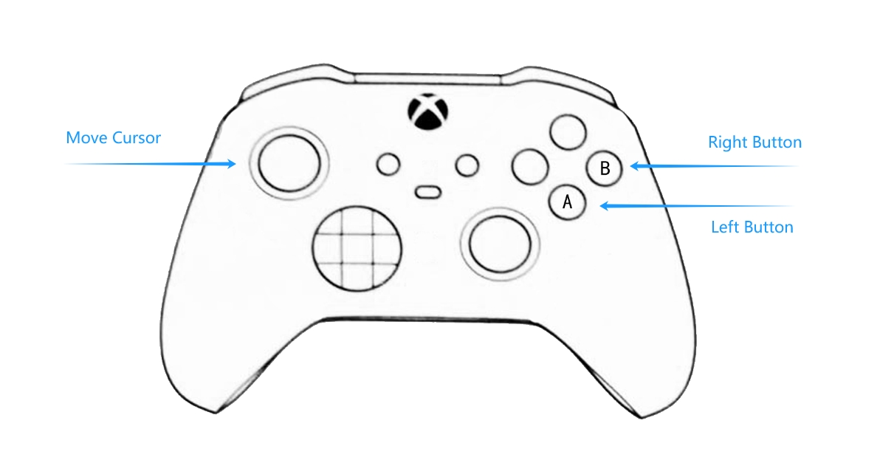

# JoyCursor

**Joystick controls the mouse cursor!**

[中文](doc/README_cn.md)

## Support

**OS:** Windows11 x64

**Device:** XBOX-Like Joystick

## Usage

Double-click the `JoyCursor.exe` file. 

Normally, the icon  will appear in the taskbar, and you can use your joystick control the mouse cursor now.

When any application goes to fullscreen, it will stop control automaticlly (and will resume control when application exit fullscreen).

## License

MIT License.